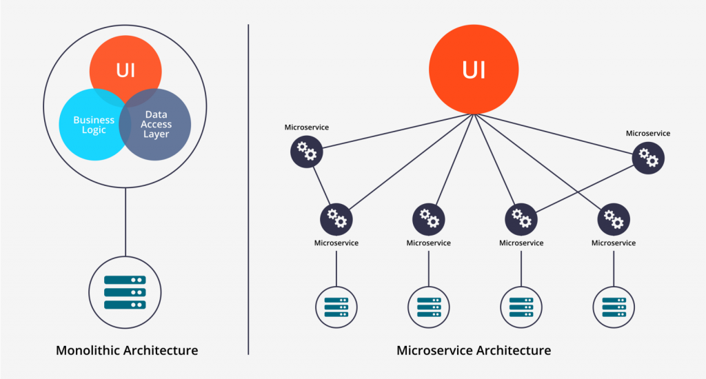
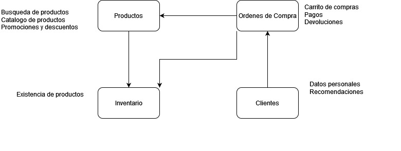

# Introducción a Microservicios

## Tabla de Contenido
1. [Antecedentes](#antecedentes)
2. [Evolución hasta los Microservicios](#evolucion-hasta-los-microservicios)
3. [Que es un microservicio?](#que-es-un-microservicio)
4. [Beneficios y Desafios](#beneficios-y-desafios)
5. [SOA vs Microservicios](#soa-vs-microservicios)
6. [API y Microservicios](#api-y-microservicios)
7. [Consideraciones](#consideraciones)
8. [Práctica de Laboratorio](#práctica-de-laboratorio)

## Antecedentes
El término fue creado por un grupo de arquitectos de software en 2012, pero recién en 2014 empezó hacerse conocido, cuando Martín Fowler, desarrollador de software y autor conocido de la comunidad, comenzó a usar el término en algunas de sus publicaciones de su página web. 

Netflix en 2009, comenzó a trasladarse de una architectura monolito a una arquitectura de microservicios incluso antes que el término fuera creado. 
 
 - En 2009, inició con el servicio encargado de la codificicación de peliculas
 - En 2010, continuó transaladando otros servicios: Suscripciones, Busqueda de películas, configuración de dispositivos, metadatos, entre otros.
 - En 2011, se había trasladado la nube en AWS, rompiendo su monolito en CIENTOS de microservicios.

## Evolución hasta los Microservicios

1) Mainframes
2) Arquitectura cliente-servidor 
3) Arquitectura de 3 Capas (Presentación->Negocio->Datos)
4) Arquitectura de N Capas 
5) Arquitectura Orientada a Servicios (SOA)
    - (Entornos con un middleware y un bus de transferencia)
    - Por ejemplo: Oracle, IBM, etc ($$$)
6) Arquitectura de Microservicios
    - Toma prestados algunos conceptos de SOA, pero pensado en estandares livianos
7) Arquitectura Serverless... 

---

## Que es un Microservicio? 
Es una arquitectura de desarrollo de software, donde una aplicación está compuesta por múltiples servicios de menor tamano, con sus propios recursos, procesos, y comunicandose entre sí por medio de mecanismos livianos, frecuentemente por HTTP con APIs. 

Cada servicio debe ser independiente, usualmente con su propia base de datos, es desplegada en su propio servidor web (usualmente embebido en la aplicación). Independiente en responsabilidad, pero puede depender de otros servicios dentro la misma aplicación.

---
## Beneficios y Desafios

### Beneficios

#### - Escalabilidad:
Los microservicios permiten escalar de forma independiente los componentes específicos de una aplicación. Esto significa que puedes asignar más recursos a los microservicios que requieren un mayor rendimiento y ajustar la capacidad según las necesidades del negocio

#### - Flexibilidad tecnólogica:
No se está atado a una única tecnología o lenguage de programación. Podemos tener un grupo de servicios en Java, otros en .Net, NodeJS y otros en Python. Aprovechando así las fortalezas de diferentes herramientas y frameworks según las necesidades de cada servicio.

Incluso dentro de un mismo lenguaje de programación utilizando stack de tecnologías diferentes. 
- Java 8, Java 11, Java 17
- SpringBoot, Dropwizard, Jakarta EE, Micronaut, Quarkus.

Si queremos actualizar las tecnologias de un servicio, al ser independiente no debe hacerse un refactor de toda la aplicación. Permitiendo una evolución más constante. 

#### - Agilidad en el desarrollo: 
En lugar de tener un equipo grande donde todos deben ser expertos en todos los módulos o servicios. Podemos tener equipos pequenos enfocadas en un sub grupo de servicios. 

Cada servicio al ser independiente, puede ser testeado y desplegado a producción de manera independiente. Haciendo que las nuevas funcionalidades o corrección de errores estén disponibles en menor tiempo. 

#### - Capacidad de Recuperación: 
El fallo en un servicio no debería de afectar la funcionalidad de toda la aplicación dado que los servicios son independientes. Esto mejora la disponibilidad y la resiliencia de la aplicación en general. Mientras se recupera el fallo de dicho servicio, otros funcionarán de manera total o parcial**.

** _Hay casos donde un servicio A depende de un servicio B, el fallo del servicio B podría afectar parcialmente al servicio A._

### Desafios con los Microservicios

#### Complejidad en la comunicación y gestión: 
La comunicación entre microservicios puede ser compleja. Se requiere una gestión adecuada de las llamadas y la sincronización entre los servicios. Además, la coordinación y el control de versiones de múltiples microservicios pueden resultar desafiantes, especialmente a medida que la aplicación crece en tamaño y complejidad.

#### Monitoreo y depuración: 
El monitoreo y la depuración en una arquitectura basada en microservicios pueden ser más complicados que en una aplicación monolítica. Debido a la distribución de los servicios, es necesario contar con herramientas y estrategias adecuadas para rastrear y solucionar problemas en cada uno de ellos. Esto implica una mayor complejidad en la gestión y el mantenimiento del entorno de producción.

#### Overhead de infraestructura: 
Cada microservicio requiere su propia infraestructura, lo que implica un mayor costo en términos de recursos y administración. La gestión de múltiples sistemas operativos bases de datos y entornos de ejecución puede generar una sobrecarga adicional en comparación con una aplicación monolítica.

#### Diseno complejo
Fragmentar una aplicación en diferentes microservicios puede llevar muchas horas de planificación (y casi podría considerarse un arte). Se necesita comprender muy bien el negocio, sus módulos, areas de dominio, para dividir la aplicación en los microservicios necesarios. 

Un balance donde la cantidad de microservicios permiten la flexibilidad del negocio sin agregar dependencias y complejidades innecesarias. 

---

## SOA vs Microservicios 
La diferencia más grande entre los dos enfoques es cómo se despliegan. 

### SOA 
- Implementa un Bus de Servicios para comunicación. 
- La comunicación suele realizar con protocolos complejos (SOAP, MQ o propietarios)
- Suele implementarse en un cluster de servidores con un Middle-ware encargado de contener los diferentes servicios.
    - Oracle, IBM 

### Microservicios
- La división de los servicios suele ser más granular, son más pequenos.
- El despliegue de aplicaciones suele basarse 
- La comunicación entre servicios suele realizar por llamadas a API (Rest, gRPC, GraphQL o SOAP)

---

## API y Microservicios

### Qué es un API?

Un API (Application Programming Interface) se puede definir como un "contrato" que expone una aplicación para que otras aplicaciones puedan comunicarse con ella. A pesar que muchas veces se relaciona API con un servicio web, esto no es necesariamente así. 

- Un API puede ser un Socket que envia tramas
- Un API puede ser una conexión remota por CORBA o RPC. 
- Un API puede ser un servicio Web en SOAP
- Un API puede ser un servicio web en REST
- Un API puede ser mensajes por medio de colas MQ

Siempre y cuando haya un contrato establecido (interface) que se respete, y que se utilice para la comunicación aplicaciones separadas, se puede considerar como un API. 

### Arquitecturas de API más utilizadas
En la actualidad hay algunos tipos de API que son comunmente utilizados en una arquitectura de Microservicios.

- Rest API
- GraphQL
- gRPC

---

## Consideraciones

Los microservicios no son la solución para todas las aplicaciones.

- Debido a su popularidad muchos empresas comenzaron a migrar sus monolitos o SOA a micro-servicios. En muchos casos sin éxito. 

- Prime Video comenzó a migrar algunos de su servicios (de monitorización calidad de audio y video) a una aplicación monolitica que los agrupa. Esto para ahorrar costos (hasta un 90%), mejorar algunos tiempos de respuesta, así como simplificar algunos flujos de trabajo.

La arquitectura de microservicios es ideal para aplicaciones grandes con múltiples módulos o áreas de dominio. Las empresas o aplicaciones con alto volumen de usuarios, que requieren escalar dinámicamente bajo demanda y adaptarse a los cambios constantes en el negocio (nuevas características, nuevas tecnologías) son un buen caso de uso para ello. Sin embargo, introduce la complejidad de la orquestación, hay demasiados elementos trabajando juntos como una unidad.

La arquitectura monolítica sigue siendo válida para algunos tipos de aplicaciones. La arquitectura monolítica es ideal para aplicaciones pequeñas debido a su rápido desarrollo, facilidad de prueba y depuración y bajo costo. Ideal para aplicaciones o negocios donde no se requiere adaptarse a cambios frecuentes a un ritmo vertiginoso. Es la forma tradicional de crear una aplicación y todavía funciona en muchos casos de uso, si el entorno es el correcto.

Un microservicio no es CRUD de recursos. Debe verse como un grupo de funcionalidades que conforman un componente independiente dentro de una aplicación.

---

## Práctica de Laboratorio

### Parte 1

Una empresa de comercio electrónico creó su aplicación siguiendo una arquitectura tradicional, durante muchos anos ha trabajado de manera correcta. Pero dado al éxito de la empresa el volumen de transacciones se incrementado exponencialmente cada mes. 

Esta aplicación inicialmente desplegada en un servidor de aplicaciones ha crecido incluso en modo cluster ya no es suficiente, y cada vez demanda más y más recursos para subir la aplicación en nuevas instancias del servidor de aplicaciones. 

La base de datos suele verse afectada, módulos menos exigentes como el carrito del usuario y las compras, se ven afectados cuando un volumen alto de usuarios está haciendo busquedas en temporada de promociones. 

Todos los días a media noche, hay procesos encargados de generar recomendaciones para los usuarios. Se ha detectado que mientras dicho proceso está siendo ejecutado, los usuarios en la aplicación se quejan de lentitud en el tiempo de respuesta del sitio. 

El equipo de desarrollo ha comenzado a analizar la opción de migrar la aplicación a una arquitectura de microservicios, que les permita responder a las exigencias del mercado con mayor flexibilidad, así como dar estabilidad a la aplicación.

Necesitamos entonces un modelo de Arquitectura de microservicios para esta aplicación.

#### Guía solución

### Parte 2
- Que lenguajes o librerías utilizaría en cada uno de los servicios creados?

#### Guía Solución

**En Productos**
  - Apache Lucene para busquedas avanzadas (Libreria en java)
  - Integración con un caché (Redis) para el catálogo de productos

**En Clientes**
- Programado en Python, para ejecutar ETL avanzados con Machine Learning para generar las recomendaciones de los clientes.

**En Inventario**
  - Utilizar JDBC (no JPA) para tener un manejo transaccional más fino con las existencias de los artículos.

