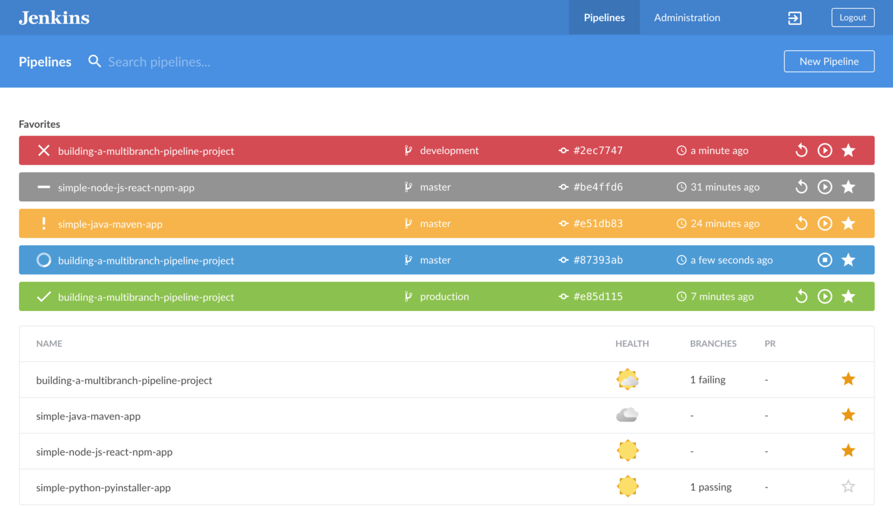

# Estrategias de Despliegue

## Tabla de Contenidos
1. [Introducción](#introducción)
1. [Monitoreo y registro de microservicios.](#monitoreo-y-registro-de-microservicios)
2. [Gestión de Configuración y Entrega Continua](#gestión-de-configuración-y-entrega-continua)   
3. [Integración y entrega continuas (CI/CD)](#integración-y-entrega-continuas-cicd)

## Introducción

Una de las complejidades de la arquitectura de micro servicios es toda la infraestructura y herramientas necesarias para orquestrar, automatizar y monitorizar el ambiente de manera efectiva. 

## Monitoreo y registro de microservicios

Que sucede cuando tenemos decenas o cientos de instancias de microservicios ejecutandose en un ambiente, y necesitamos saber si todo se encuentra en orden, o si hay un error es necesario encontrar la causa del error entre tantos sistemas al mismo tiempo. 

**Observabilidad** es el principio de "Aplicationes Nativas a la Nube" que se debe seguir en los micro servicios. Una correcta observabilidad se componente de: 

- **Logs/Registros**: Mensajes de información o error, que nos permite saber que sucede en la aplicación. 
    - Librerias como Log4J2, Logback, SLF4J son muy comunes en Java. 

- **Metricas**: Exponer métricas que nos permitan saber datos del sistema recursos (memoria, cpu, conexiones a base de datos), cantidad de usuarios concurrentes, peticiones http por minuto an un endpoint, cantidad de errores en peticiones http, entre otras. 
    - Existe un estandar llamada **Prometheus**, que expone diferentes métricas en nuestro sistema. En Spring tenemos el módulo **Spring Actuator** que nos permite exponer métricas del sistema y propias.

- **Rastreo Distribuido**: Cuando tenemos un micro-servicio A, que llama al micro-servicio B, que llama al micro-servicio C, como se puede ser capaces de rastrear esa solicitud de manera eficiente. 
    - Hay iniciativas como Open Tracing, con implementaciones como **Jaeger** y **Zipkin** que nos permiten agregar esta funcionalidad de manera sencilla.

- **Health Checks**: Cada micro-servicio debe ser capaz de exponer un endpoint que retorne su estado de salud actual, y el de sus dependencias (base de datos, conexiones a otros servicios, etc). De manera que un sistema en mal estado, pueda alertar de manera automática. 

- **Alertas**: Que sucede cuando un health check o una métrica (cantidad de errores 400, o 500) por minuto está excediendo cualquier umbral permitido. La idea es tener un sistema automatizado de alertas, que detecte estas situaciones y envíe una notificación a los interesados. 

### Herramientas para Observabilidad:

Lo ideal es tener un stack de herramientas que nos ayuden a recolectar toda la información disponible (logs, metricas, healthchecks, etc) de forma centralizada, con minima intervención manual. 

Herramientas como: 
- Kibana,   (gratuita)
- Grafana,
- Jaeger,
- Splunk,
- Datadog,
- Dynatrace,
- entre otras. 

En sistema maduros, este tipo de monitoreo puede generar un volumen enorme de datos, que debe considerarse como un costo en la infraestructura.

## Gestión de Configuración 

Un principio del uso de los contenedores en la arquitectura de micro-servicios es que nos permiten que sean inmutables. Es decir, la imagen no cambia sea cual sea el ambiente o entorno donde se este ejecutando. 

Esto nos permite reproducir el mismo codigo en nuestro ambiente local, como ambiente de pruebas, como uno de produccion. Siempre utilizando la misma imagen de docker. 

Pero que sucede con configuraciones que varian segun el ambiente? 
Estamos hablando de conexiones a base de datos, URL de servicios dependientes, credenciales, y diferentes valores que seran diferente en cada ambiente. 

### Variables de Ambiente
La practica mas extendida es almacenar la configuración en variables de entorno (a menudo abreviadas como env vars o env). 

- Las variables de entorno son fáciles de cambiar entre implementaciones sin cambiar ningún código
- A diferencia de los archivos de configuración, hay pocas posibilidades de que se registren accidentalmente en el repositorio de código
- Y a diferencia de los archivos de configuración personalizados u otros mecanismos de configuración como las propiedades del sistema Java, son un estándar independiente del idioma y del sistema operativo.

De esta manera que todo lo que sea configurable en su aplicacion, sus valores deben ser inyectados desde una variable de ambiente. En Java y Spring, se puede utilizar las bondades de **Spring Cloud Config** para facilitar su uso. 

### Centralizacion de las configuraciones
Esta suele ser una tarea de los Devops, y sus pipelines de CI/CD. La meta es que todas las configuraciones esten centralizadas en algun sistema, de manera que durante el Despliegue (deployment) de un servicio o aplicacion, se tomen los valores de dicho sistema centralizado, y se incluyan en el servicio como una variable de Ambiente.

Algunos ejemplos de herramientas para centralizar configuraciones:
- AWS Parameter Store
- HashiCorp Vault

Ademas en su ciclo de vida, en un ambiente DevOps, podemos estan relacionadas con otras como: 
- GIT
- Terraform
- Ansible
- Docker

## Integración y entrega continuas (CI/CD)

### Integracion Continua
La integración continua (CI) es la práctica de automatizar la integración de los cambios de código de varios contribuidores en un único proyecto de software. Es una de las principales prácticas recomendadas de DevOps, que permite a los desarrolladores fusionar con frecuencia los cambios de código en un repositorio central donde luego se ejecutan las compilaciones y pruebas. Las herramientas automatizadas sirven para verificar que el nuevo código es correcto antes de la integración.

#### Fases de un pipeline de Integración Continua

Estás son las fases que regularmente encontramos en un pipeline de integración continua (CI).

- **Trigger**: Se detecta que nuevos cambios han sido integrados al código (push en GIT, commit en SVN). Esto dispara el pipeline, que validará dichos cambios son seguros. 

- **Build**: Se obtiene el código con los cambios aplicados y se compila. En Java la utilización de Maven, Gradle o Ant facilita este paso. 

- **Test**: Una vez el código se asegura que compila correctamente, se ejecutan todas las pruebas unitarias. Por ejemplo pruebas unitarias en Java con JUnit. 

- **Deployment**: Se prepara un despliegue (deployment) "temporal" de la aplicación, para verificar que el código no solamente compila, y pasa los unit tests, sino que es capaz de iniciar la aplicación sin problemas. 
    - Se puede usar una base de datos temporal o en memoria, o un schema separado al principal. 

- **Integration Tests**: Se ejecutan pruebas de integración, más robustas y completas que prueben funcionalidades del sistema, en ese deployment "temporal".

- **Publicación**: Se publican librerias, ejecutables o imagenes docker de la aplicación en un repositorio, para su posterior utilización.

- **Clean up**: Una vez las pruebas de integración han terminado, se elimina el deployment temporal, la base de datos temporal, y cualquier otro artefacto generado que no sea necesario. 

Si cualquiera de los pasos anteriores falla, se dice que el pipeline es fallido, se notifica a los interesados (equipo de desarrollo),  y el código (el branch en SVN o pull request en GIT) no es válido para ser integrado y promovido a los ambientes.

Cuando un pipeline es correcto, podemos tener un mayor grado de certeza que el código es relativamente estable, y no se introducen errores antes de integrarlo. 

### Entrega Continua
La entrega continua es una práctica de desarrollo de software mediante la cual se preparan automáticamente los cambios en el código y se entregan a la fase de producción. La integración continua nos generó artefactos validados para ser promovidos. 

Aplicar estos cambios en un ambiente de pruebas o producción debe estar automatizado. Esto no significa que automáticamente se sube a producción, sino que significa que toda la configuración para un despliegue en un ambiente está automatizada. 

> Ya no es necesario ir a N servidores de producción a instalar la aplicación manualmente. Correr scritps de base de datos, y cambiar configuraciones. Todo esto está automatizado.

Cuando se considere apropiado, alguien con permisos de promover los cambios, puede presionar un botón que inicia todo el proceso de despliegue de una versión a un ambiente (pruebas o producción). 

#### Zero Downtime
Este es un principio que se desea lograr en la arquitectura de microservicios cuando se implementan y despliegan nuevos cambios en uno o más servicios. Dado que la implementación de nuevos cambios es relativamente más frecuente, el objetivo es que la aplicación no este "caida" o en "mantenimiento" mientras esto sucede. 

Existen estrategias como: 

- **Blue/Green Deployment**: Mientras se sube la nueva versión, la anterior aún co-existe. El balanceador de carga apunta a la versión anterior hasta que estamos seguros que la versión nueva está correctamente instalada. En ese momento, se hace un "swap", es decir el balanceador de carga deja de apunta a la versión anterior y comienza a apuntar a la nueva.  Finalmente, se desinstala la versión anterior. 

- **Canary Release**: Esta estrategia es un poco más complicada, similar al blue/green deployment, varias versiones de la aplicación co-existente a la misma vez. Sin embargo, el balanceador apunta a una u otra según algun criterio (zona, pais, grupo de usuarios beta, etc). Se mantienen ambas versiones co-existiendo por más tiempo, hasta que se determine que es seguro aplicar la última versión a todos.

### Herramientas de CI/CD 

Usualmente estas herramientas están a cargo de los DevOps, ellos son quienes definen los pipeline de "Integración Continua" y las reglas para automatizar la "entrega continua" con sus respectivas estrategias de despliegue. 

Las herramientas más comunes son: 
- Jenkins
- Azure Devops 
- AWS Code Deploy
- Octopus
- Circle CI

La elección de una herramienta u otra, depende de las necesidades y caracteristicas de cada negocio y empresa.

