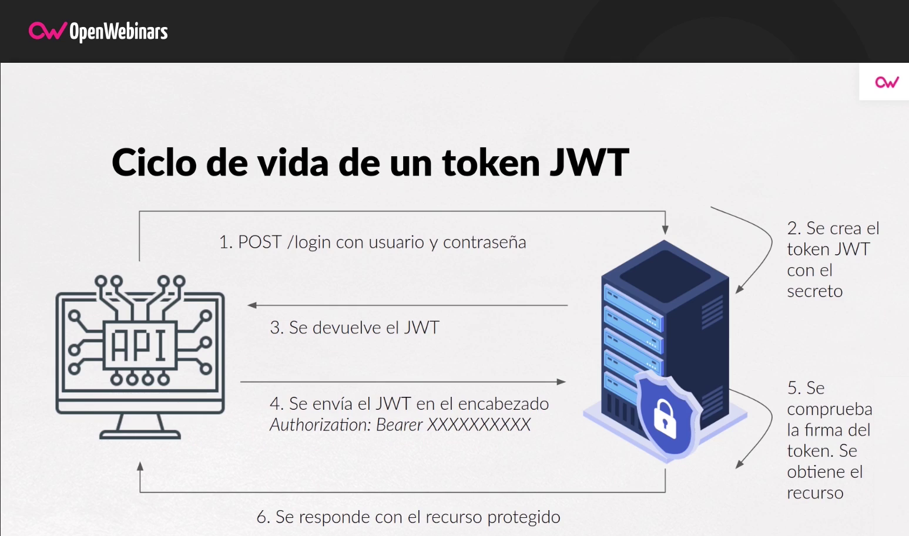

# Seguridad y Escabilidad

## Tabla de Contenidos
1. [Principios de Seguridad en Microservicios](#principios-de-seguridad-en-microservicios)
2. [Autenticación y Autorización de Microservicios](#autenticación-y-autorización-de-microservicios)
3. [Manejo de Vulnerabilidades y Riesgos](#manejo-de-vulnerabilidades-y-riesgos)
4. [Escalabilidad y Rendimiento de Microservicios](#escalabilidad-y-rendimiento-de-microserviios)   
5. [Práctica](#práctica)

--- 

## Principios de Seguridad en Microservicios

Estos son algunos principios básicos para mantener una seguridad minima en nuestros microservicios. 

### Utiliza conexiones seguras - HTTPS y SSL
En la médida de lo posible es importante utilizar siempre conexiones seguras para la comunicación entre los servicios. HTTPS y SSL en el caso de Rest APIs. 

### Gestiona secretos en las pipelines de CI/CD

Las pipelines suelen contener información sensible de nuestra aplicación, como contraseñas o tokens, que debe cifrarse mediante external secrets, como AWS Secrets Manager o HashiCorp Vault.

Aunque estas configuraciones suelen indicarse como Variables de Ambiente (Env Vars) en los contenedores, debemos de diferenciar aquellas que contengan datos sensibles, de tal manera que no se encuentren almacenadas en texto plano donde sean accesibles a terceros. 

### Exponer solo los servicios necesarios y por los puertos necesarios

Limita al máximo posible los elementos expuestos a Internet, de modo que solo se publiquen los microservicios imprescindibles (Frontend, API Gateway, etc), dejando restringidas las bases de datos, el Backend y el core de la aplicación.

### Implementa Autenticación y Autorización en los Rest API
Restringir el uso del API por medio de un mecanismo de Autenticación y/o Autorización es importante. De tal manera que persona ajenas a nuestra aplicación no encuentren y utilicen nuestros servicios para sus propios propositos. 
- Aqui podemos mencionar mecanismos como JWT, OAuth2, SAML e incluso Basic Http Authentication.


---
## Autenticación y Autorización de Microservicios

Es importante tener claro estos conceptos: 

- **Autenticación**:  Es el proceso para verificar los usuarios, servicios o aplicaciones son quien dicen ser, y pueden acceder a los recursos de nuestra aplicación.

- **Autorización**: Es e proceso para verificar los permisos sobre recursos que tiene una entidad (usuario, servicio, aplicación). 

> Un usuario puede ser quien dice ser (estar autenticado), pero no necesariamente tiene permisos para realizar ciertas acciones (estar autorizado).

### Json Web Token - JWT
JWT (JSON Web Token) es un estándar qué está dentro del documento RFC 7519.

En el mismo se define un mecanismo para poder propagar entre dos partes, y de forma segura, la identidad de un determinado usuario, además con una serie de claims o privilegios.

Estos privilegios están codificados en objetos de tipo JSON, que se incrustan dentro de del payload o cuerpo de un mensaje que va firmado digitalmente. Este JSON se codifica en formato `base64` dando como resultado un Token que es compartido entre los servicios.


### Seguridad en Rest API con JWT
Existen diferentes formas de agregar seguridad (autenticación y autorización) a nuestros Rest API. Sin embargo, JWT es una de los mecanismos más utilizados por su sencillez y robustes. 

- Creamos un mecanismo de autenticación, por ejemplo un endpoint para `login` donde se debe utilizar un usuario y contraseña. Si el usuario y contraseña son correctos, entonces se generará un JWT con algunos datos del usuario (identificador, email, nombre, entre otros). Y el JWT es retornado como respuesta a dicha autenticación. 

    - Este mecanismo de autenticación puede ser un Servidor de Autorización en nuestro ambiente: OAuth2, SAML, o incluso un endpoint en un Rest API propio. 

    - Los tokens suelen tener una fecha de expiración por lo cual pueden ser reutilizar por un lapso de tiempo.

- Cada vez que desee acceder a un recurso (endpoint) con seguridad, es necesario enviar el JWT generado. La forma más estandarizada en un Rest API es mediante un header `Authorization` con el valor `Bearer <Token JWT>`.

- El Endpoint debe de obtener el header `Authorization` del encabezado y verificar que su contenido esa un JWT válido (utilizando los datos en su firma, usualmente una llave publica). Si el JWT es considerado válido, entonces se continua con el Rest API, en caso contrario se debe retornar un error 401 (Unauthorized). Dentro del token se pueden agregar atributos/claims que nos permita saber quien es el usuario e incluso algunos permisos de este. 



### Service to Service Tokens (S2S tokens)

Que sucede si quien debe comunicarse es un proceso en segundo plano, donde no se involucra un usuario y una contrasena? Por ejemplo un servicio, comunicandose con otro en una operacion que no se asocia a una accion de un usuario. 

Aqui es donde se puede crear un S2S token (Service to Service Token). El concepto es el mismo, un token JWT, el Servicio cliente utiliza una llave publica y privada para autorizarse. Luego el servicio Receptor compara dicha la validez de dicha llave publica. 

### Spring Security y JWT 

De nuevo Spring Framework ya un módulo disponible para la implementación de Seguridad en nuestras aplicaciones, este módulo es **Spring Security**. Esto requiere de varios pasos y bastantes lineas de código, pero una vez implementado funcionara de manera global. 

1) Agregar la dependencia 

```
<dependency>
    <groupId>org.springframework.boot</groupId>
    <artifactId>spring-boot-starter-security</artifactId>
</dependency>


<!-- https://mvnrepository.com/artifact/io.jsonwebtoken/jjwt-api -->
<dependency>
    <groupId>io.jsonwebtoken</groupId>
    <artifactId>jjwt-api</artifactId>
    <version>0.11.5</version>
</dependency>
<!-- https://mvnrepository.com/artifact/io.jsonwebtoken/jjwt-impl -->
<dependency>
    <groupId>io.jsonwebtoken</groupId>
    <artifactId>jjwt-impl</artifactId>
    <version>0.11.5</version>
</dependency>
<!-- https://mvnrepository.com/artifact/io.jsonwebtoken/jjwt-jackson -->
<dependency>
    <groupId>io.jsonwebtoken</groupId>
    <artifactId>jjwt-jackson</artifactId>
    <version>0.11.5</version>
</dependency>

```

2) Crear una clase que contiene datos del usuario

```
public class Principal {
    private String username;
    private Instant expirationDate;
    //Cualquier otro campo util
}
```

2) Crear un componente que valida los JWT 

``` 
@Component
public class JwtService {

    public static final String SECRET = "357638792F423F4428472B4B6250655368566D597133743677397A2443264629";

    public String extractUsername(String token) {
        return extractClaim(token, Claims::getSubject);
    }

    public Date extractExpiration(String token) {
        return extractClaim(token, Claims::getExpiration);
    }

    public <T> T extractClaim(String token, Function<Claims, T> claimsResolver) {
        final Claims claims = extractAllClaims(token);
        return claimsResolver.apply(claims);
    }

    private Claims extractAllClaims(String token) {
        return Jwts
                .parserBuilder()
                .setSigningKey(getSignKey())
                .build()
                .parseClaimsJws(token)
                .getBody();
    }

    private Boolean isTokenExpired(String token) {
        return extractExpiration(token).before(new Date());
    }

    public Boolean validateToken(String token) {
        final String username = extractUsername(token);
        return (username != null && !isTokenExpired(token));
    }

    private Key getSignKey() {
        byte[] keyBytes = Decoders.BASE64.decode(SECRET);
        return Keys.hmacShaKeyFor(keyBytes);
    }
}

```

3) Crear un Web Filter que los Endpoint con seguridad tenga un token válido

```
@Component
public class JwtAuthFilter extends OncePerRequestFilter {

    @Autowired
    private JwtService jwtService;

    @Override
    protected void doFilterInternal(HttpServletRequest request, HttpServletResponse response, FilterChain filterChain) throws ServletException, IOException {

        String authHeader = request.getHeader("Authorization");
        String token = null;
        String username = null;
        Instant expiration = null;

        if(authHeader != null && authHeader.startsWith("Bearer ")){
            token = authHeader.substring(7);
            username = jwtService.extractUsername(token);
            expiration = jwtService.extractExpiration(token).toInstant();
        }

        if(username != null && SecurityContextHolder.getContext().getAuthentication() == null){
            if(jwtService.validateToken(token)){
                Principal principal = new Principal();
                principal.setUsername(username);
                principal.setExpiration(expiration);
                UsernamePasswordAuthenticationToken authenticationToken = new UsernamePasswordAuthenticationToken(principal, null);
                authenticationToken.setDetails(new WebAuthenticationDetailsSource().buildDetails(request));
                SecurityContextHolder.getContext().setAuthentication(authenticationToken);
            }

        }

        filterChain.doFilter(request, response);
    }
}
```

4) Configurar en Spring la seguridad a los endpoints

``` 
@Configuration
@EnableWebSecurity
@EnableMethodSecurity
public class SecurityConfig {

    @Autowired
    JwtAuthFilter jwtAuthFilter;

    @Bean
    public SecurityFilterChain securityFilterChain(HttpSecurity http) throws Exception {
        return http.csrf().disable()
                .authorizeHttpRequests()
                .requestMatchers("/api/v1/login").permitAll()
                .and()
                .authorizeHttpRequests().requestMatchers("/api/v1/**")
                .authenticated()
                .and()
                .sessionManagement()
                .sessionCreationPolicy(SessionCreationPolicy.STATELESS)
                .and()
                .authenticationProvider(authenticationProvider())
                .addFilterBefore(jwtAuthFilter, UsernamePasswordAuthenticationFilter.class).build();

    }

    @Bean
    public PasswordEncoder passwordEncoder() {
        return new BCryptPasswordEncoder();
    }

    @Bean
    public AuthenticationProvider authenticationProvider() {
        DaoAuthenticationProvider authenticationProvider = new DaoAuthenticationProvider();
        authenticationProvider.setUserDetailsService(userDetailsService());
        authenticationProvider.setPasswordEncoder(passwordEncoder());
        return authenticationProvider;

    }

    @Bean
    public AuthenticationManager authenticationManager(AuthenticationConfiguration config) throws Exception {
        return config.getAuthenticationManager();
    }
}
```

---

## Manejo de Vulnerabilidades y Riesgos

### Al día con actualizaciones de SO
Es una regla básica, pero a pesar de los entornos de contenedores no espamos de ella. Es estar a día con actualizaciones de Sistema Operativo y Software, para evitar vulnerabilidades.

### Utiliza imagenes de fuentes confiables

Las imagenes de docker para crear contenedores muy pocas veces (si no es que nunca) son creadas 100% por nosotros mismos. La práctica es utilizar imagenes como base, con el sistema operativo o tecnologías ya configuradas (por ejemplo con Linux y JDK 17 instalado). 

Hay que estar seguros que dichas imagenes no incluyen código malicioso o vulnerabilidades. Por lo tanto es necesario utilizar imagenes solamente de sitios confiables. 

### Utiliza herramientas scanner de contenedores

El punto anterior nos lleva irremediablemente a este. Si has optados por los contenedores listos para usar, dispones de herramientas como Trivy (de Aqua Security) y Snyk, que escanean contendores, IaC como Terraform e, incluso Kubernetes, que permiten integraciones en Github Actions.

Una de las ventajas de poder integrar este tipo de scaners en nuetros CI/CD es que de manera automatizada tendremos un seguimiento de los fallos de seguridad y vulnerabilidades que se desplieguen en entornos altos como puede ser producción.

### Utiliza herramientas de scanner de Código

Afortunadamente existen iniciativas abiertas que sirven como repositorios de vulnerabilidades en librerias existentes. 

CVE viene de **Common Vulnerabilities and Exposures**. Este es una base de datos disponible publicamente que clasifica vulnerabilidades y problemas de seguridad. Podemos agregar elementos en nuestros pipelines de CI/CD para que analicen las dependencias en nuestro proyectos y verifique si incluimos librerias con vulnerabilidades reportadas. 

En Maven/Gradle existe un plugin facilmente configurable. Con él podemos analizar nuestro código y reportar errores si tenemos una dependencia vulnerable, así como configurar niveles aceptables de vulnerabilidad, o ignorar vulnerabilidades del chequeo si fuera necesario.

```
<plugin>
    <groupId>org.owasp</groupId>
    <artifactId>dependency-check-maven</artifactId>
    <version>9.1.0</version>
    <executions>
        <execution>
            <goals>
                <goal>check</goal>
            </goals>
        </execution>
    </executions>
</plugin>
```

---

## Escalabilidad y Rendimiento de Microserviios

La escalabilidad de microservicios, dentro del contexto de la arquitectura de microservicios, se refiere a la capacidad de una aplicación para manejar de manera eficiente una mayor carga de trabajo distribuyendo la carga entre múltiples instancias de servicios de aplicaciones. 

Para esto debemos de implementar varias estrategias que se han mencionado e implementado durante el curso, como lo son: 


- **Escalar Horizontalmente**: En lugar de agregar más recursos de memoria y cpu a las aplicaciones actuales (escalar verticalmente), evaluar agregar más instancias de la misma aplicación (escalar horizontalmente). 
    - Por ejemplo en Docker Compose con el uso de replicas. 

Esto nos permitirá reaccionar de manera ágil cuando se detecta un volumen alto de peticiones o transacciones. 

- **Balanceadores de Carga**: Al tener muchas instancias de una mismo servicio, es necesario distribuir la carga de procesamiento de manera equitativa entre todas ellas. Para esto se puede utilizar Balanceadores de Carga. Actualmente es muy común los balanceadores por Software, en lugar de por Hardware como hace 10 o mas anos atras. 

    - Ejemplo de esto es NGINX, que posee un módulo para proporcionar esta funcionalidad.
    - Herramientas como Docker Compose, disponen de DNS internos que balancean la carga de un servicio entre sus instancias.
    - Herramientas como Kubernetes, tienen el concepto de Servicio que incorporan esta funcionalidad también.


- **Uso de Caché**: Utilice herramientas de cacheo de datos para reducir el tiempo de respuesta para obtener datos de frecuente uso, además de liberar de estres a la base de datos u otros servicios.  
    - Pueden ser caché internas en cada servicio, **Spring Cache** es un módulo disponible para su uso, también tenemos Google Cache del proyecto Guava, o simplemente un HashMap en nuestra aplicación. 
    - Pueden ser también caché externas, como **REDIS** que funcionan como una base de datos en memoria donde podemos almacenar datos de frecuente uso entre distintas instancias e incluso distintos servicios. Otra aplicación similar es AWS Dynamo DB. 


## Práctica
### Spring Security

Utilice el proyecto para la leccion, ubicado en la carpeta `/Laboratorios/secured-rest` para ver un ejemplo de un Rest API con seguridad por medio de JWT. 

- El endpoint `api/v1/login` recibe un usuario y contrasena, y en caso de ser validos genera un JWT token. 

- Los APIs para users `api/users/**` pueden ser utilizados sin necesidad de un JWT como header de autenticacion.

- Los APIs para books `api/books/**` requieren de un JWT valido, de otra manera retorna un 403. 

Analice el codigo generado y su funcionamiento. Realice pruebas desde POSTMAN.


