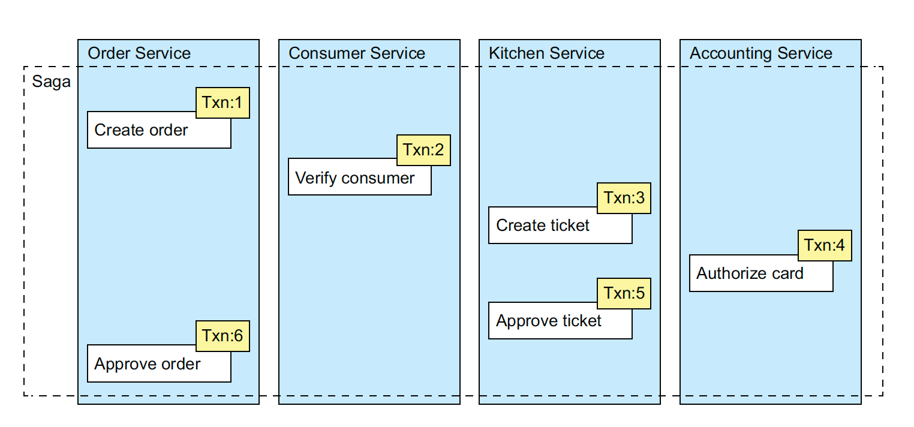
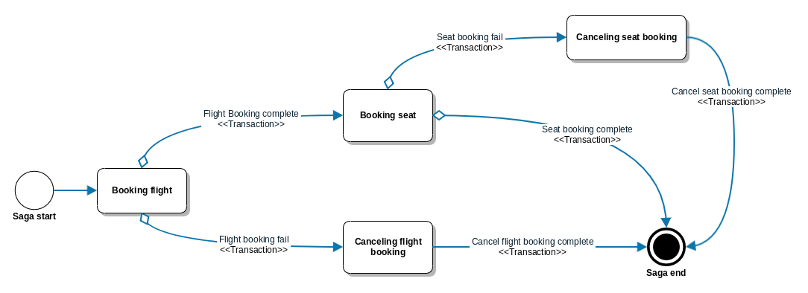
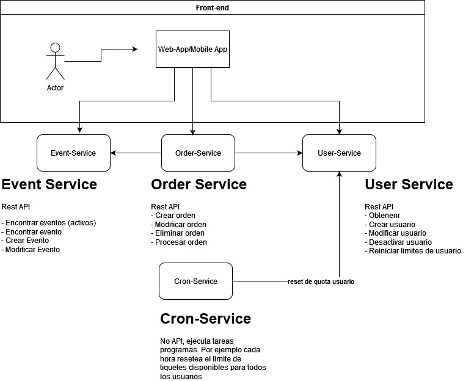

# Arquitectura de Microservicios

## Tabla de Contenidos
1. [Manejo de Transacciones](#manejo-de-transacciones)

    1.1. [Patrón Sagas](#patrón-sagas)

    1.2. [Métodos Compensatorios](#métodos-compensatorio)

    1.3. [Patrones de Implementación Sagas](#patrones-de-implementación-de-sagas)

2. [Conclusiones](#conclusiones)   
3. [Proyecto](#proyecto)

---
## Manejo de Transacciones

Las transacciones son un ingrediente esencial de todas las aplicaciones empresariales. Sin transacciones, sería imposible mantener la coherencia de los datos.

Uno de los grandes problemas y que más dolores de cabeza puede dar por trabajar con microservicios es sin duda la gestión de las transacciones distribuidas que abarquen múltiples servicios e intermediarios en la operación.

Esto en el mundo de los monolitos es relativamente fácil de manejar, ya que las operaciones se encuentran dentro del mismo ámbito. 

En el caso de los microservicios es más complejo, la aplicación debe utilizar un mecanismo más elaborado para gestionar las transacciones. El enfoque tradicional de utilizar transacciones distribuidas no es una opción viable para las aplicaciones modernas. En cambio, una aplicación basada en microservicios debería utilizar sagas.

### Patrón SAGAS
Una SAGA se es un mecanismo que se utiliza para mantener la coherencia de los datos de microservicios, una saga es simplemente una secuencia de transacciones locales, cada transacción actualiza los datos en un servicio independiente.

La saga inicia con el primer paso, cada finalización de un paso, inicial el siguiente paso, hasta llegar al paso final. 

A primera vista, las sagas parecen sencillas, pero su uso presenta algunos desafíos. Un desafío es la falta de aislamiento entre sagas. Otro desafío es revertir los cambios cuando ocurre un error. Es por esto que los cambios deben revertirse mediante la compensación de transacciones.

### Métodos Compensatorio
En una aplicación tradicional, se crea una transacción en base de datos y se utiliza la operación **ROLLBACK** para deshacer cualquier modificación efectuada en pasos anteriores dentro de dicha transacción en caso de detectarse un error. 

Un metódo o transacción compensatoria, es un método que deshace de manera manual un cambio realizado por una transacción anterior. Por ejemplo 
- Si tengo un método "Aprobar Ticket", debo tener un método compensatorio "Rechazar ticket".
- Si tengo un método "Realizar Pago", debo tener un método compensatorio "Reversar pago".

Si la Saga falla en la transacción en el paso 4, la aplicación debe deshacer "explicacitamente"  los cambios realizados en los primeros tres pasos mediante la ejecución de sus transacciones compensatorias. Saga ejecuta las transacciones de compensación en el orden inverso a las transacciones previas. 

### Patrones de implementación de Sagas

Ahora que tenemos una idea conceptual de qué es el patrón saga, vamos a ver dos patrones a la hora de implementarlo:

**Mediante Coreografía:** Bajo este patrón, tendremos la implementación de la lógica de la misma distribuida a lo largo de los servicios que intervienen (participantes). Cada servicio debe conocer e implementar cómo responder a cierto o ciertos estados (eventos) de la saga.

**Mediante Orquestación:** Habrá un proceso o servicio encargado de la coordinación de los steps de la saga al que llamaremos manager o coordinador de la saga. Este manager aglutina toda la lógica de la saga simplificándola de esta manera y evitando dependencias cíclicas entre servicios.

## Conclusiones
Estos son los aspectos que debemos tener en cuenta a la hora de implementar nuestro patrón saga:

- Este patrón es aplicable para mantener la consistencia de datos en arquitecturas basadas en microservicios.
- Es un patrón stateful y necesitaremos mantener el estado persistente.
- A la hora de implementarlo es aconsejable hacerlo de forma asíncrona basándonos en mensajes.
- Es necesario tener en cuenta la concurrencia de sagas e implementar contramedidas para solucionar las posibles anomalías.

--- 
## Proyecto

Es muy común que durante eventos masivos como conciertos las boleterías eletrónicas se saturan, y presentan gran cantidad de errores y tiempos de espera a los usuarios debido al alto volumen operaciones. 

# Titi-ckets

**Titi-ckets** es la nueva plataforma de compra de tiquetes en linea que se nos ha solicitado desarrollar. El analisis de requeremientos y arquitectura ha determinado que demos utilizar una arquitectura basada en Microservicios para esta aplicación, ya que permitirá hacer un uso eficiente de recursos en tiempos donde no hay alta demanda de usuarios y a la vez responder ante eventos másivos donde el volumen de usuarios puede incrementarse en poco tiempo. 

Además, nos permitirá evolucionar la herramienta de manera ágil, ajustandonos a los cambios en el mercado en cuanto a tecnologías, y requerimientos del negocio. 

El equipo de Front-end ya ha comenzado con el desarrollo de la capa de presentación de las aplicaciones que utilizarán los usuarios. Están trabajando en una versión Web, con Responsive Design utilizando React, y aplicaciones moviles. Pero, debemos iniciar lo antes posible con el back-end y toda la lógica de negocio detrás de dichas aplicaciones.

### Requerimientos Funcionales

- Se pueden agregar nuevos eventos, cada evento tiene una capacidad definida de asistentes. 
- Los usuarios pueden crear ordenes de compra, donde indicarán que evento y cuantos tiquetes desean comprar. 
- Para minimizar el acaparamiento de entradas en pocas manos, un usuario puede comprar solamente 5 tiquetes cada hora, sin importar el evento. 
- Esta validación de 5 tiquetes por hora será verificada al momento de realizar la compra, es decir "procesar la orden de compra".
- Debe proporcionarle la opción de registrar nuevos usuarios al sistema, así como ver sus detalles. 
- No se puede crear o procesar ordenenes de compra antes de la fecha de inicio de venta de boletos.
- No se puede crear o procesar ordenes de compra luego de la fecha del evento.
- No se puede crear o procesar para un usuario inactivo, o que no existe.

### Requerimientos no funcionales

- La aplicación debe proveer alta disponibilidad en sus servicios. Es decir, que si una instancia de un servicio está caida, existe otro servicio capaz de responder. 

- Además se espera implemente buenas prácticas en tolerancia a fallos, en caso que hayan errores de comunicación (red) temporales, incluso con el sistema en buen estado. 

- El front-end espera consumir estás funcionalidades por medio de un Rest API. A estos equipos les gustaría tener buena documentación, actualizada constantemente, y de fácil acceso para estos Rest API disponibles. 

### Diseno de la aplicación

Es por esto que se ha definido 4 micro-servicios como parte del back-en de la aplicación ***Titi-ckets***.

- **user-service**: 
Este servicio se encarga de administrar el registro de usuarios en el sistema, su información. Además lleva el control de cuantos tiquetes disponibles para comprar tiene dicho usuario en la próxima ventana de tiempo (un usuario solamente puede comprar 5 tiquetes de cualquier evento por hora).
    - identificador de usuario (autogenerado)
    - Nombre Completo
    - correo electrónico
    - Dirección
    - Estado (Activo/Inactivo)
    - tickets comprados (este se reinicia cada hora)

- **event-service**:
Este servicio se encarga de administrar los eventos disponibles. Cada evento tiene: 
    - Nombre
    - Descripción
    - Fecha de evento
    - Cantidad de espacios
    - Cantidad de espacios reservados
    - Fecha de inicio de venta de boletos

Se encarga de llevar el control de los espacios reservados y disponibles para cada evento, de manera que un evento no puede vender/reservar más tiquetes que los definidos para dicho evento.

- **order-service**: 
Este servicio es el encarga de administrar las ordenes de compra. Una orden de compra tiene: 
    - id
    - Identificador de usuario
    - Identificador de evento. 
    - Cantidad de tiquetes a comprar
    - Estado de la orden (Pendiente/Procesada/Cancelada)

Un usuario puede registrar una orden de compra, y mientras no la procese aun puede modificarla.

- **cron-service**: 
Este no expone un rest API a otros servicios, pero se comunica con otros servicios de manera periodica para ejecutar tareas automatizadas. Por ejemplo, debe llamar cada hora al `user-service` para restablecer la cantidad de tiquetes disponibles para cada usuario. 

### Entrega
Este proyecto debe estar terminado para el día correspondiente a la lección 12. El objetivo es que durante los siguientes días previos a la fecha de entrega, cada estudiante vaya avanzando en el proyecto agregando funcionalidades con los conocimientos ya adquiridos, y los conocimientos por adquierir en las siguientes lecciones.

Debe ser presentado y diferentes elementos serán discutidos durante su presentación para conocer el nivel de conocimiento y completitud de la solución entregada. 

